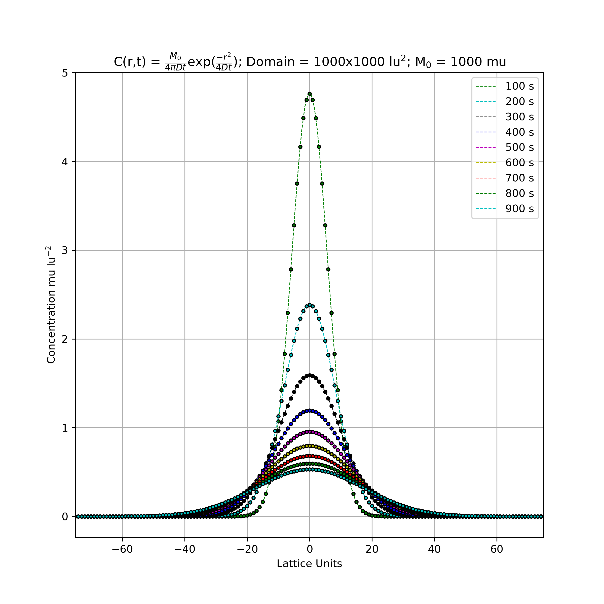
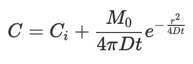

Validation of 2D Diffusion with Palabos
=======================================

See page 132-133 from *Lattice Boltzmann Modeling: An Introduction for Geoscientists and Engineers* 
This Palabos program is for validating diffusion in a (infinite) two dimensional domain agains a known analytic solution.

---

Figure 69 from *Lattice Boltzmann Modeling: An Introduction for Geoscientists and Engineers*

---

This directory houses a 2D implementation of the Lattice Boltzmann equation for advection/diffusion (pure diffusion i.e. velocity = [0,0]) for a point source (Concentration = M_0 = 1000) in the center of an infinite (for our instance we use 1000 x 1000) domain. The concentration does not reach the boundaries by the end of the time stepping and therefore periodic boundary conditions are used. The function *centerPointSetup* instantiates the initial conditions and initializes the lattice.

The analytic solution for this problem is:

The file *figure69.py* solves the analytical solution for the given conditions and plots it as dashed lines, while plotting the corresponding *Palabos* solution with solid circles.

Values Used
-----------

| parameter     | value |
| ---           | ---  |
| Ci | 0    |
| M0 | 1000 |
| D             | 1/6  |
| nx | 1000 |
| ny | 1000 |

palabosRoot
-----------

Refer to the Makefile to see where *palabosRoot* needs to be with respect to this directory for correct compilation. It is currently set to two directories up (../..). This is one level nearer than the tutorials direcotires that come with palabos.
