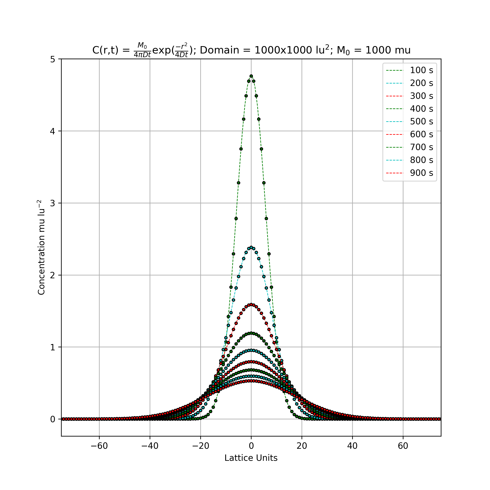

Validation of 2D Diffusion with Palabos
=======================================

See page 42 from *Lattice Boltzmann Modeling: An Introduction for Geoscientists and Engineers* 
This Palabos program is for validating diffusion in a (infinite) two dimensional domain agains a known analytic solution.

---

Figure 69 from *Lattice Boltzmann Modeling: An Introduction for Geoscientists and Engineers*

---

This directory houses a 2D implementation of the Lattice Boltzmann equation for advection/diffusion (pure diffusion i.e. velocity = [0,0]) for a point source (Concentration = M_0 = 1000) in the center of an infinite (for our instance we use 1000 x 1000) domain. The concentration does not reach the boundaries by the end of the time stepping and therefore periodic boundary conditions are used.

The analytical solution for this problem is:

$$C = C_i+ \frac{M_0}{4\pi Dt} e^{- \frac{r^2}{4Dt}}$$

The file *figure69.py* solves the analytical solution for the given conditions and plots it as dashed lines, while plotting the corresponding *Palabos* solution with solid circles.

Values Used
-----------

| parameter | value |
| --- | --- |
| $C_i$ | 0 |
| $M_0$ | 1000 |
| $D$ | 1/6 |
| $n_x$ | 1000 |
| $n_y$ | 1000 |

Note
----

The -.5 in the LBM plotting is accounted for in the following way: nx = 1000 so when *centerPointSetup* instantiates the variable center_x, (plint center_x = nx/2) this returns 500 $\rightarrow$ from a zero-based array this is .5 to the right of the center of the domain.
